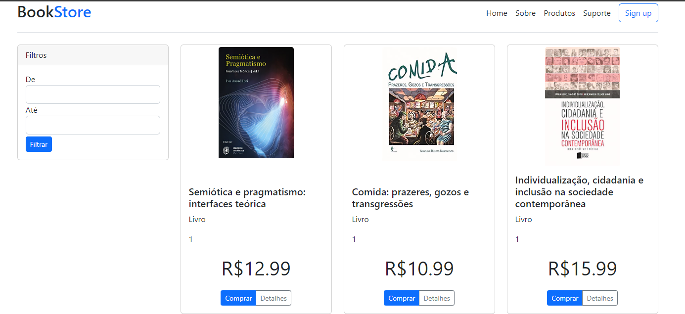
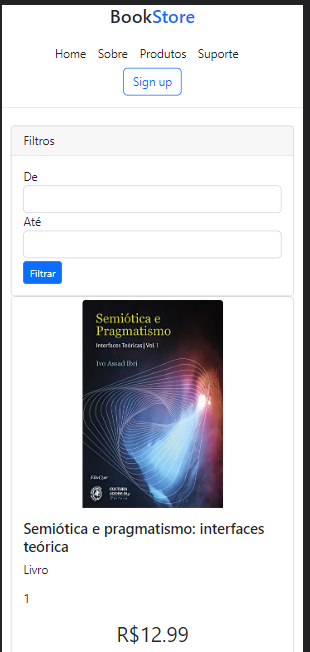

<p align="center">
  

  

  <a href="https://www.twitter.com/JefersonLabout/">
    
  </a>
  
  <a href="https://github.com/Jeferson-Labout/e-commerce-dio/commits/main">
    
  </a>
    
   
   <a href="https://github.com/Jeferson-Labout/e-commerce-dio/stargazers">
    
  </a> 
</p>
<h1 align="center">
    
</h1>

<h4 align="center"> 
	🚧  E-commerce 💳 Concluído 🚀 🚧
</h4>

<p align="center">
 <a href="#-sobre-o-projeto">Sobre</a> •
 <a href="#-layout">Layout</a> • 
 <a href="#-como-executar-o-projeto">Como executar</a> • 
 <a href="#-tecnologias">Tecnologias</a> • 
 <a href="#-autor">Autor</a> • 
 <a href="#user-content--licença">Licença</a>
</p>


## 💻 Sobre o projeto
<p align="center">
Nesse projeto foi lançado o desafio de criar a tela inicial de um E-commerce  
</p>
<p align="center">
Projeto desenvolvido durante a Santander Bootcamp Fullstack Developer
</p>
<p align="center">


</p>


---

## 🎨 Layout


### Mobile

<p align="center">
  


</p>

### Web

<p align="center" style="display: flex; align-items: flex-start; justify-content: center;">
  
</p>

---

## 🚀 Como executar o projeto

Este projeto é divido em duas partes:
1. Backend (pasta server) 
2. Frontend (pasta web)


💡O Frontend  precisa que o Backend esteja sendo executado para funcionar.

### Pré-requisitos

Antes de começar, você vai precisar ter instalado em sua máquina as seguintes ferramentas:
[Git](https://git-scm.com), [Node.js](https://nodejs.org/en/). 
Além disto é bom ter um editor para trabalhar com o código como [VSCode](https://code.visualstudio.com/)

#### 🎲 Rodando o Backend (servidor)

```bash

# Clone este repositório
$ git clone git@github.com:Jeferson-Labout/e-commerce-dio.git

# Acesse a pasta do projeto no terminal/cmd
$ cd e-commerce-dio

# Vá para a pasta e-commerce-dio-backend
$ cd e-commerce-dio-backend

# Instale as dependências
$ npm install

# Execute a aplicação em modo de desenvolvimento
$ npm start

# O servidor inciará na porta:3001 - acesse http://localhost:3001

```


#### 🧭 Rodando a aplicação web (Frontend)

```bash

# Clone este repositório
$ git clone git@github.com:Jeferson-Labout/e-commerce-dio.git

# Acesse a pasta do projeto no seu terminal/cmd
$ cd e-commerce-dio

# Vá para a pasta da aplicação e-commerce-dio
$ cd web

# Instale as dependências
$ npm install

# Execute a aplicação em modo de desenvolvimento
$ ng serve

# A aplicação será aberta na porta:4200 - acesse http://localhost:4200

```

---

## 🛠 Tecnologias

As seguintes ferramentas foram usadas na construção do projeto:

#### **Website**  ([Angular](https://angular.io/)  +  [TypeScript](https://www.typescriptlang.org/))

-   **[Bootstrap](https://getbootstrap.com/)**

> Veja o arquivo  [package.json](https://github.com/Jeferson-Labout/e-commerce-dio/blob/master/web/package.json)

#### [](https://github.com/Jeferson-Labout/e-commerce-dio#server-nodejs--typescript)**Server**  ([NodeJS](https://nodejs.org/en/)  +  [TypeScript](https://www.typescriptlang.org/))

-   **[Json Serve](https://my-json-server.typicode.com/)**

> Veja o arquivo  [package.json](https://github.com/Jeferson-Labout/e-commerce-dio/blob/master/server/package.json)


---

## 🦸 Autor

<a href="https://github.com/Jeferson-Labout/">
 
 <br />
 <sub><b>Jeferson Labout</b></sub></a> <a href="https://www.linkedin.com/in/jeferson-labout-91686015b/" title="Linkedin">🚀</a>
 <br />

[](https://twitter.com/JefersonLabout) [](https://www.linkedin.com/in/jeferson-labout-91686015b/) 
[](mailto:jefson1989@gmail.com)

---

## 📝 Licença

Este projeto esta sobe a licença [MIT](./LICENSE).

Feito com ❤️ por Jeferson Labout 👋🏽 [Entre em contato!](https://www.linkedin.com/in/jeferson-labout-91686015b/)

---

